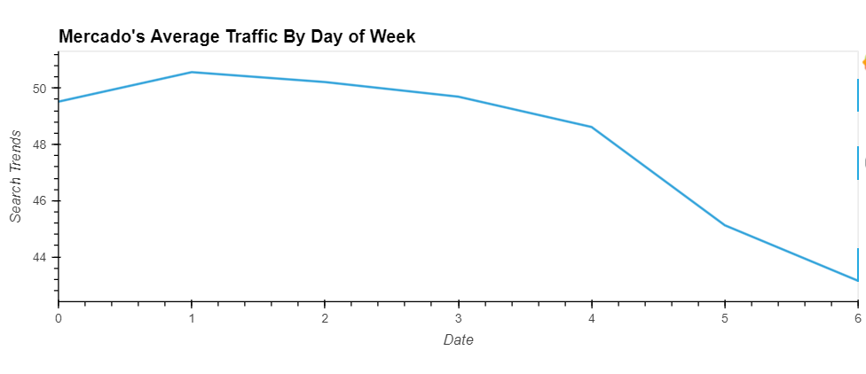
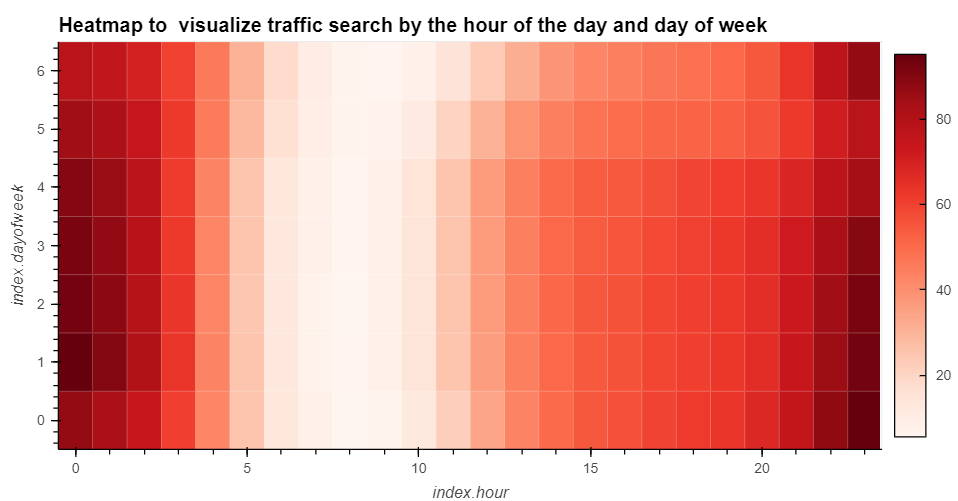
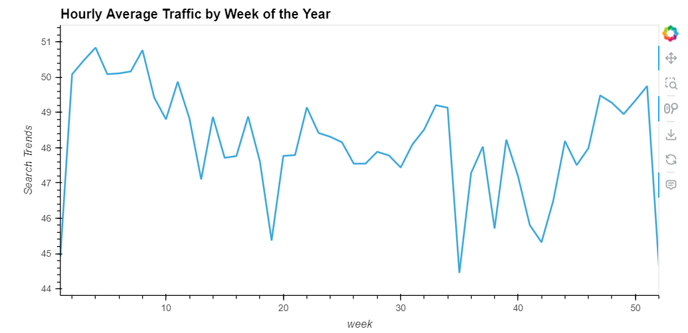
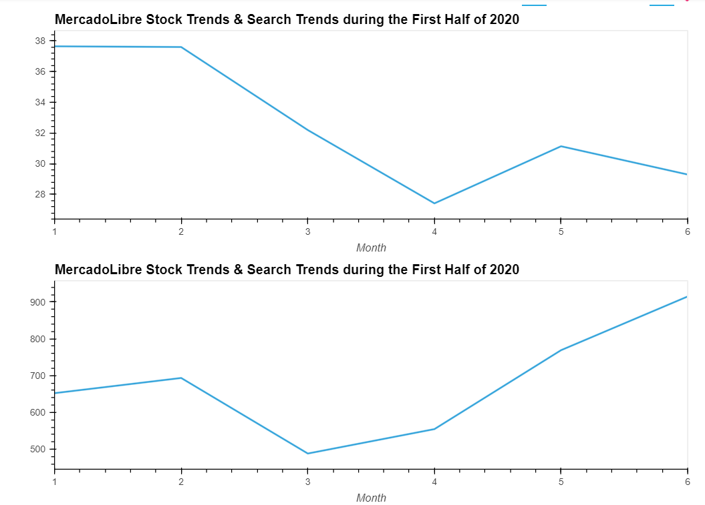
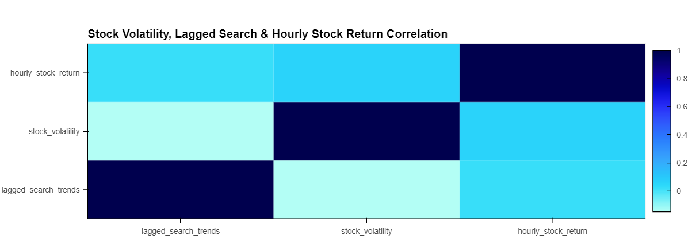
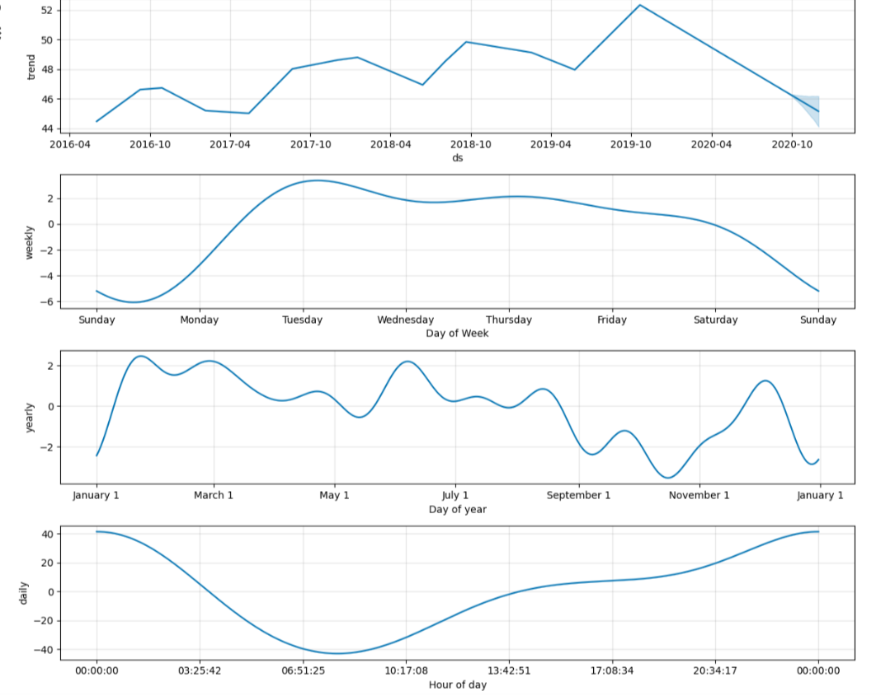
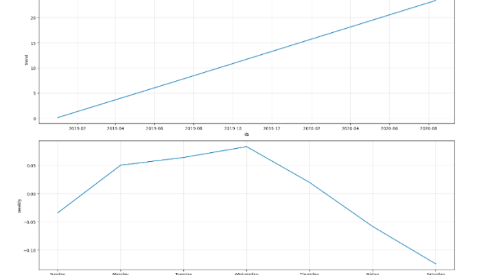

# MercadoLibre Time Series Analysis

This jupyter notebook prepares and analysis time series data for an e-commerce site based upon the company's google search trend, stock prices and daily revenue generated by business. These analysis have been performed using Google Colab workspace and Facbook Prophet Algorithm. Specifically, it includes the following analysis:

* Visual depictions of seasonality (as measured by Google Search traffic) that are of interest to the company.

* An evaluation of how the company stock price correlates to its Google Search traffic.

* A Prophet forecast model that can predict hourly user search traffic.

* A plot of a forecast for the company’s future revenue.

## Summary fof Results:

* Q1: Did the Google Search traffic increase during the month (May 2020) that MercadoLibre released its financial results?

      Our analysis revealed that search traffic during the month that MercadoLibre released its financial results were 8.5% higher than the median of all months. Total search Traffic during May 2020 was 38181 whereas the median of all months is 35172.
      
      
* Q2:  Does any day-of-week effect that you observe concentrate in just a few hours of that day?

       Data visulized through Heatmap reflected that pattern of hourly search was generally consistent for the entire week.Traffic search was higher between hours 0-3 and hours 20-23 while slow going hours were between 5-10 which started to accelerate after 12th hour and this pattren continued till the end of day. Additionally overall traffic was relatively higher for the weekdays as compared to weekend.
       
       
| traffic by day of week                                          | Heatmap                          |
| -------------------------------------------------               | ----------------------------------- |
|       | 

      
       
      
* Q3: Does the search traffic tend to increase during the winter holiday period (Weeks 40 through 52)?

      Yes, search traffic tended to increase during winter holiday period i.e. weeks 40 through 51 and it sharply dropped after week 51.

      

* Q4:  Does time series for Google Search Trend and Stock Price indicate a common trend that’s consistent between the search data and the company stock price?

      No, the trend between two time series is not consistent. After March 2020's decrease, closing prices were seen with rising trend during first half of 2020 with its peak in June 2020. In contrast, the search_trend seen a sharp decrease in March and reached to lowest point in April which kept fluctuating during May and June. However, the trend for this series is declining during first half of 2020.
      
      The volatility spiked, and tended to stay high, during the first half of 2020. This is a common characteristic of volatility in stock returns worldwide: high volatility days tend to be followed by yet more high volatility days. When it rains, it pours.
      
 

* Q5:  Does a predictable relationship exist between the lagged search traffic and the stock volatility or between the lagged search traffic and the stock price returns?

       Although correlation between lagged search traffic and stock volatility is negative but this relationship is relatively stronger than the lagged search traffic and the stock price returns.
       

  
       
* Q6:  From the Prophet time series analysis, it could be seen that:

       Tuesday is the peak day of the week for google traffic whereas on daily basis search trend starts to increase gradually after 10 am and reaches to its peak around mid_night.
       October is the lowest point for search traffic in the calendar year whereas summer and winter months are peak months.
       

     
       
       From Prophet plot_component function, it can be seen that overall trend for company's revenu is rising. As regards, weekly analysis, revenue starts to increase from Monday and continues to its peak i.e. Wednesday. After Wednesday it starts to gradually decrease untill it reaches its lowest point i.e. saturday.
       From the forecast, it could also be predicted that most probable revenue could be $ 969 millions which could jump to $ 1051 millions. In worst, it could go down to $887 millions.
       

       
       
